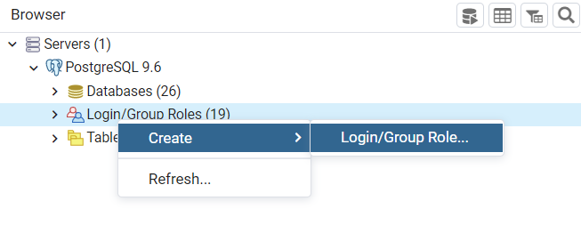
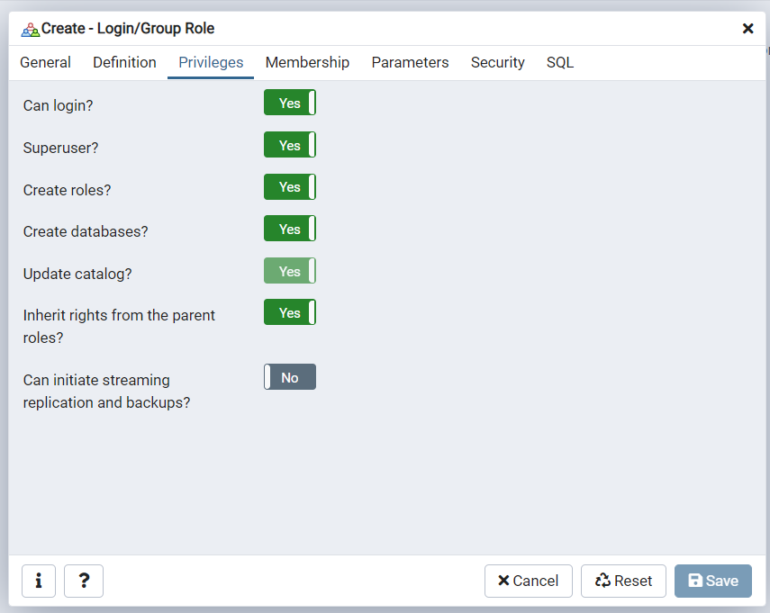
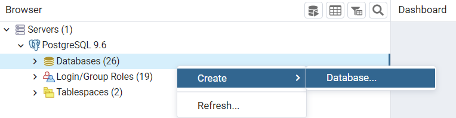
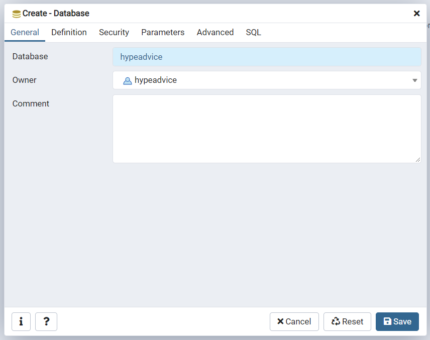

# Projeto Hype Advice

Siga as orientações abaixo para configurar o projeto:

* Faça o download e instalação do postgres versão **9.6.24** no link https://www.enterprisedb.com/downloads/postgres-postgresql-downloads
* Faça o download e instalação do pgAdmin no link https://www.pgadmin.org/download/
* Após instalado e configurado crie um super user com nome **hypeadvice** e senha **hypeadvice** no pgAdmin

* Crie um data base com nome **hypeadvice** e defina o owner **hypeadvice**

**IMPORTANTE:** garanta que o data base fique em "jdbc:postgresql://localhost:5432/hypeadvice", caso contrario atualize o parametro spring.datasource.url do arquivo application.properties

* Baixe as dependências via **Maven**

Após iniciar a aplicação, acesse http://localhost:8080/advice-list.xhtml